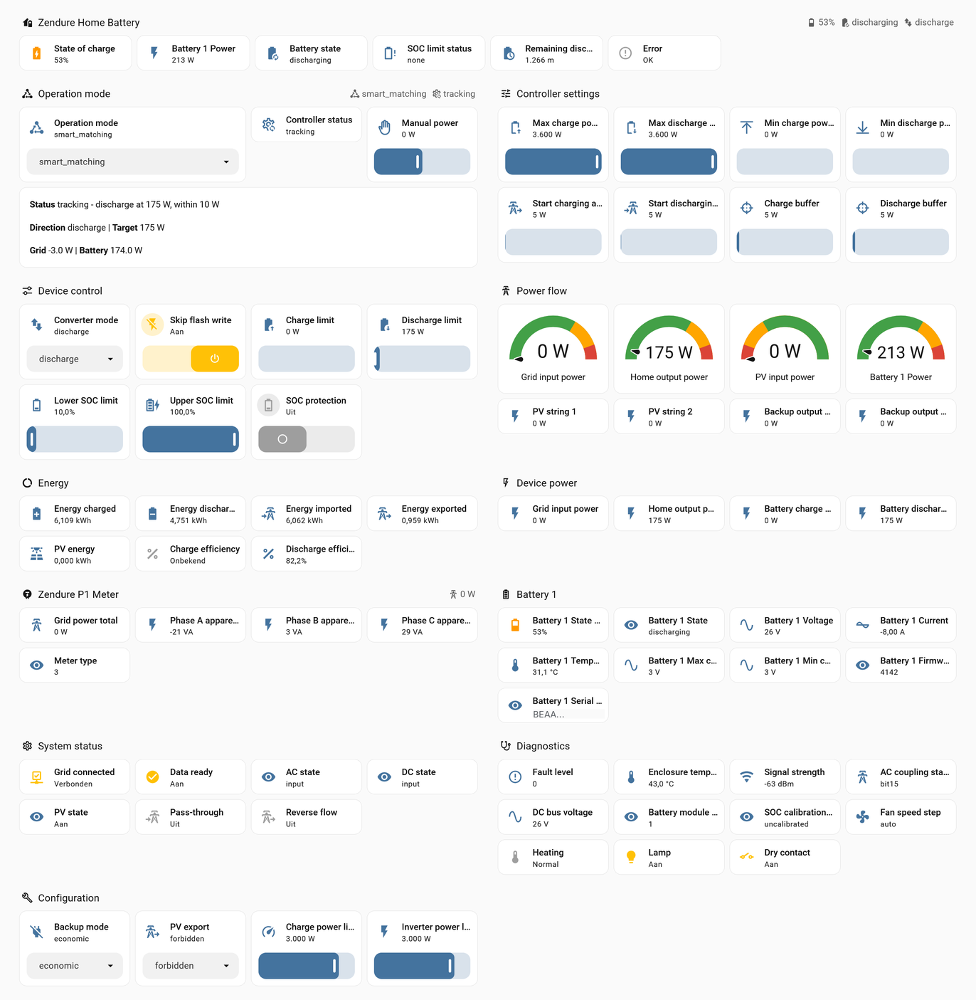

# Zendure RestAPI – Home Assistant Integration

[](https://github.com/hacs/integration)
[](https://github.com/windsurf/hassio-zendure-restapi/releases)

> **Disclaimer:** This software is not affiliated with or endorsed by Zendure in any way. It is provided "as-is" without warranty or support, for the educational use of developers and enthusiasts. Use at your own risk.

Local monitoring and control of Zendure SolarFlow batteries and the Zendure P1 meter over the zenSDK HTTP API. No cloud account, no MQTT broker, no Bluetooth pairing — the device runs a plain JSON REST server on your LAN and this integration talks to it directly.

Beyond reading the device, the integration runs an **operation-mode controller**: seven strategies that turn a price decision made elsewhere into charge and discharge limits, tracking a linked meter towards zero grid exchange.

> **Actively tested with:** Zendure SolarFlow 3000 Mix AC+ (`solarFlow3000MixAC+`) and the Zendure P1 meter (three-phase, meterType 3)



*The example dashboard, showing `smart_matching` holding the grid at zero: the house draws
175 W, the battery supplies it, and the meter reads 0 W. A ready-made view is included — see
[Dashboard](#dashboard).*

---

## Before you start

Under EN 18031 the local HTTP API is **disabled by default**. Enable it first:

> Zendure app → add **HEMS** → exit the app to apply.

Verify from a terminal before configuring anything:

```bash
curl -X GET "http://<device-ip>/properties/report"
```

If that returns JSON, the integration will work. If it returns nothing, the local API is still off and no amount of configuration will help.

---

## Installation via HACS

[](https://my.home-assistant.io/redirect/hacs_repository/?owner=windsurf&repository=hassio-zendure-restapi&category=integration)

1. HACS → Integrations → three-dot menu → Custom repositories
2. Add `https://github.com/windsurf/hassio-zendure-restapi`, category **Integration**
3. Install **Zendure RestAPI**, then restart Home Assistant

## Manual Installation

Copy `custom_components/zendure_restapi/` into your Home Assistant `config/custom_components/` directory and restart. A full restart is required — a reload leaves stale bytecode in `__pycache__`.

---

## Setup

Devices broadcast over mDNS as `_zendure._tcp`, so Home Assistant usually discovers them and offers them under **Settings → Devices & Services**. If discovery does not fire, add the integration manually and enter the device IP.

Add the battery and the meter as **separate entries**. The controller links to the meter automatically when exactly one is present.

The polling interval is configurable from 1 to 60 seconds under **Configure**. The default is 10 seconds, and it doubles as the control interval.

### Device support

Entity creation is driven by the properties the device actually reports, not by a hard-coded model list. Every SolarFlow device shares one generic property set, so an unlisted or brand-new model still gets full entity coverage; it is simply labelled `SolarFlow (generic)` until its name is added to `registry.py`.

Model naming prefers the `product` field in the report payload, which is authoritative. The mDNS service name is only a fallback.

### The P1 meter

The meter reports a flat payload with a `deviceId` and **no serial number at all**. Identity therefore falls back to `deviceId`, and no writable entities are created because writes require a serial. It is read-only by nature.

---

## Dashboard

`dashboard/zendure.yaml` is the view in the screenshot above: twelve sections covering
operation, controller settings, power flow, energy, the P1 meter, per-battery detail,
diagnostics and device configuration.

Paste it under `views:` in a dashboard in YAML mode, or open **Edit dashboard → three-dot menu
→ Raw configuration editor** and add it there.

Cards carry no `name:` override on purpose, so every label comes from the integration. Renaming
an entity in Home Assistant changes the dashboard along with it and the two cannot drift apart.

Entity IDs in the file were derived from the device name *Zendure SolarFlow 3000 Mix AC+*.
Home Assistant deviates on a name clash — appending `_2` — or after the device is renamed, so
verify under **Developer tools → States** filtered on `zendure` if cards come up empty.

---

## How the controller works

The strategy is a single `select` entity, `Operation mode`:

| Mode | Behaviour |
|---|---|
| `standby` | Hands off. Reads and reports, writes nothing |
| `manual` | Follows the `Manual power` number; its sign picks charge or discharge |
| `smart_matching` | Tracks the grid meter towards zero exchange, both directions |
| `smart_charge_only` | Absorbs surplus only; never discharges |
| `smart_discharge_only` | Covers demand only; never charges |
| `quick_charge` | Charges at the configured maximum, ignoring the meter |
| `quick_discharge` | Discharges at the configured maximum, ignoring the meter |

The default is `standby`, so nothing moves until a mode is chosen deliberately.

### Once per poll, not on a timer

The controller runs at the end of each coordinator refresh. That matters: a separate timer would sooner or later apply a correction based on readings from the previous cycle, correcting twice for one deviation. That is how oscillation gets built.

### Why standby writes nothing

A zero is still a command. Earlier versions had `standby` write zeros to both limits, and on a device running its own energy manager that produces a fight: the manager sets a discharge limit to cover the house, the integration overwrites it with zero on the next poll, the manager sets it back. Measured on hardware as a square wave in grid power at the polling interval.

The single exception is on entering `standby`: a limit is cleared once, and only if this controller set it. A limit set by the device's own manager is never touched.

### The smart control loop

```
charging:    target = clamp( (-grid - battery + charge_buffer)    * factor , floor , max )
discharging: target = clamp( ( grid + battery - discharge_buffer) * factor , floor , max )
```

Four details do the real work.

**The first step is undershot** (factor 0.75 rather than 1.00). The device's actual response is not yet known, so committing the full correction invites overshoot. Once the direction holds, the controller balances at 1.00.

**Direction is read from the device, not from memory.** The controller's own record is empty after a restart, a reload or a mode switch, while the device carries on with the limit it was last given. Deriving direction from which limit is non-zero avoids waiting for an idle state that cannot arrive.

**Start thresholds gate starting, not continuing.** A direction already running keeps being balanced whatever the grid does, so it winds down to zero when the load disappears. A direction the mode forbids is cleared and released.

**Idle means a direction change is safe, not that no direction is running.** A limit of 30 W
sits inside the deadband while the device is still charging, so the running direction is only
considered over when the device reports both limits at zero.

**Idle is decided by what is commanded**, not by measured power. An inverter draws its own standby power continuously — a 3000 Mix AC+ idles at roughly 41 W — so the pack never reads zero. Both limits at zero means a direction change is safe regardless.

### Buffers and thresholds

Both buffers mean the same thing: how many watts of grid **import** to aim for. The default is 5 W on each side, so the loop settles just on the consuming side of zero. That is deliberate — overshooting into import wastes the difference between the import tariff and the value of the stored energy, while undershooting into export gives away energy worth the import tariff for the feed-in rate, roughly a third of it.

Both start thresholds are a distance from zero, expressed as a positive number of watts. Which side of zero they sit on is in the name: `Start discharging at import` counts import, `Start charging at export` counts export.

Keep each start threshold further from zero than its buffer, or the direction never starts.

### Minimum power

`Min charge power` and `Min discharge power` raise the target above what the meter asks for, in every smart mode. Both default to 0, which disables the floor.

With a 400 W charge floor and 100 W of surplus, the device charges 400 W: 100 from the surplus, 300 bought from the grid. That is the point — the energy is cheap now and worth more later. Note that zero-on-the-meter only holds while both floors are at 0.

The two directions are not symmetric in value. Overcharging is compared against the future import tariff, the full retail price; overdischarging exports at the feed-in rate. Setting the charge floor is usually worthwhile, setting the discharge floor rarely is.

### Reversing direction

`Direction change delay` pauses between opposite directions: the current limit is cleared, the
configured number of seconds elapses, then the new direction is written. It defaults to 10
seconds, matching the default polling interval; set it to 0 to reverse immediately.

The smart modes already wind a direction down before starting the other one, but `quick_charge`,
`quick_discharge` and `manual` write their target straight away — so a mode switch could take
several kilowatts from full charge to full discharge inside one cycle. A 3000 Mix AC+ handles
that; an older or smaller inverter may not.

The pause is timed rather than counted in polls, and the clock starts when the opposite limit
is actually cleared rather than when the mode changed, so it cannot elapse while the old
direction is still running. A pause already under way outranks the device state — clearing the
limits is the first thing it does, and reading the resulting "no direction" as nothing to
reverse from would end the pause on the next cycle. Controller status shows `reversing` with
the seconds remaining.

At a polling interval coarser than the delay the pause lasts one full cycle: it is never
shorter than configured, only longer.

### Safety

If the meter stops reporting, both limits go to zero — a closed loop without feedback is worse than no loop. Below the lower SOC bound the battery is charged back regardless of strategy, except in `manual` and `quick_discharge` where the operator's intent is explicit; switchable off.

`smartMode` is set to RAM before writing limits, so frequent adjustments never reach flash. At a ten second interval that is tens of thousands of limit writes a year.

---

## Supported Entities

| Group | Count | Entities |
|---|---|---|
| **Sensor** | 50 | AC coupling status, AC state, Backup output power, Backup output power 2, Battery charge power, Battery discharge power, Battery module count, Battery state, DC bus voltage, DC state, Enclosure temperature, Fan level, Fan speed step, Fault level, Battery power, Grid input power, Home output power, PV input power, PV state, PV string 1–6, Remaining discharge time, SOC calibration status, SOC limit status, Signal strength, State of charge · *disabled by default:* Activation voltage, Bind state, Device timestamp, Factory mode state, Grid HD status, HV battery voltage (raw), IoT connection state, LCN state, Legacy mode, Message id, OTA state, Off-grid state, Phase switch, Powerhub status, Report timestamp, Slave address, Timezone, Timezone offset, Voltage wake-up, Write response |
| **Per battery** | 11 | Current, Max cell voltage, Min cell voltage, Power, State, State of charge, Temperature, Voltage · *disabled by default:* Firmware version, Pack type, Serial number |
| **Energy** | 5 | Energy charged, Energy discharged, PV energy, Energy imported, Energy exported |
| **Efficiency** | 2 | Charge efficiency, Discharge efficiency |
| **Binary sensor** | 12 | Data ready, Dry contact, Error, Fan, Grid connected, Heating, Lamp, Pass-through, Reverse flow · *disabled by default:* HV battery control, PV-AC coupling, SOC compensation |
| **Number** | 7 | Charge limit (AC), Charge power limit, Discharge limit, Inverter power limit, Lower SOC limit, Upper SOC limit · *disabled by default:* Calibration interval |
| **Select** | 5 | Backup mode, Converter mode, PV export · *disabled by default:* Fan speed mode, Grid standard |
| **Switch** | 2 | Skip flash write · *disabled by default:* Fan forced on |
| **Controller** | 13 | Operation mode, Controller status, Manual power, Direction change delay, Max charge power, Max discharge power, Min charge power, Min discharge power, Start discharging at import, Start charging at export, Charge buffer, Discharge buffer, SOC protection |
| **P1 meter entry** | 6 | Grid power total, Phase A/B/C apparent power, Meter type · *disabled by default:* Protocol type |

Entities appear only when the device reports the underlying key. `PV string 3`–`6`, `Fan level` and `Fan` are documented in zenSDK but absent from the 3000 Mix AC+ payload, so they are never created on that model.

---

## The Energy dashboard

The device publishes no cumulative counters, so kilowatt-hours are integrated here.

| Entity | Source | Feeds |
|---|---|---|
| Energy charged | `outputPackPower` | Home battery storage, energy in |
| Energy discharged | `packInputPower` | Home battery storage, energy out |
| PV energy | `solarInputPower` | Solar production, DC-connected panels only |
| Energy imported / exported | meter `total_power` | Grid consumption and return |

Integration is trapezoidal: each interval uses the average of the previous and current reading, which is exact for any linear ramp. Gaps beyond five minutes are skipped rather than bridged, and readings that are negative or above 20 kW are ignored. Totals persist across restarts and are never reset on reload — the Energy dashboard reads a drop as a meter replacement and would double-count.

All sources are AC-side fields, matching the side the meter is on. Conversion loss therefore stays visible as the gap between the grid figures and the battery figures rather than being absorbed into them.

### Conversion efficiency

Two diagnostic sensors surface that loss. `Charge efficiency` is DC over AC, `Discharge efficiency` is AC over DC. Only packs in the matching state contribute.

Expect 94–95% at meaningful power. The figure drops sharply at low power because the converter's own consumption is nearly constant: at 122 W of output it costs around 41 W, so efficiency falls to about 75%. That is not a measurement error — it is why trickle-discharging is expensive.

---

## Notes on correctness

The zenSDK document is wrong or incomplete in several places. Each correction below was found by comparing it against live hardware.

**Temperatures** are stored in tenths of a Kelvin: `(raw - 2731) / 10`.

**Pack voltage** (`totalVol`) is in centivolts despite the document listing whole volts. A raw 2688 is 26.88 V.

**SOC setpoints** (`socSet`, `minSoc`) are in tenths of a percent. The document's `minSoc` range of 0–50 is also wrong; a live sample read 800, meaning 80.0%.

**Pack current** (`batcur`) is a 16-bit two's complement value in deciampere. Read unsigned, every discharge becomes roughly 6500 A.

**`gridReverse`** value 2 forbids PV export and 1 allows it. The document offers no labels; reading 2 as `auto` would be permissive on a device that is actually blocking export.

**The key is `oldMode`,** not `OldMode` as documented.

Three independent checks confirm the voltage and current scales, across samples at very different power levels:

| Check | Sample 1 | Sample 2 |
|---|---|---|
| `totalVol` × `batcur` vs reported pack power | 26.88 V × 22.8 A = 613 W vs 612 W | 26.80 V × 1.7 A = 45.6 W vs 46 W |
| Cell voltage × 8 vs `totalVol` | 3.36 V × 8 = 26.88 V | 3.35 V × 8 = 26.80 V |

The cell-count agreement also identifies the pack as 8S LFP.

---

## Brand images

The integration ships its own icon and logo in `custom_components/zendure_restapi/brand/`. Home Assistant 2026.3 and later picks these up directly, taking priority over the brands CDN; older versions ignore the folder and fall back to the default placeholder. No submission to `home-assistant/brands` is needed.

---

## Debug logging

The controller logs every decision it makes at `DEBUG`: which property is written and what it
held before, which writes are skipped because the device already holds the value, why a
reversal pause started and how long remains, and the resulting state with the readings behind
it.

```yaml
# configuration.yaml
logger:
  default: warning
  logs:
    custom_components.zendure_restapi: debug
```

A typical reversal reads:

```
write inputLimit: 3000 -> 0
skip outputLimit=0, device already holds it
reversal charge -> discharge: cleared both limits, pausing 10s
reversing | pausing 10s before discharge | dir=none target=0W grid=0.0W battery=-3000.0W
reversing | pausing 5s before discharge  | dir=none target=0W grid=0.0W battery=-3000.0W
reversal pause elapsed, discharge may start
write acMode: 1 -> 2
write outputLimit: 0 -> 3000
quick | discharging at maximum | dir=discharge target=3000W grid=0.0W battery=-3000.0W
```

The status sensor shows the outcome; this shows the reasoning that led there, which is what you
need when a mode does something unexpected three steps into a sequence.

## Reporting an unsupported property

The integration logs every reported key it has no entity for, once each, at `INFO` level. For a complete picture, download diagnostics from the device page: the file contains the device report plus the full list of unrecognised keys.

Diagnostics files end up attached to public issues, so identifying values are stripped first. That covers both the plain keys and their flattened per-pack form — `pack1.sn` is redacted along with `sn`, which an exact-match filter would miss. The MQTT status is summarised rather than copied, because its contents are undocumented and may carry a broker address or device key.

---

## Known limitations

**No failsafe if Home Assistant stops.** A limit written before the outage keeps executing —
the device has no watchdog that returns it to zero. Keep `Max charge power` and
`Max discharge power` at values you would accept running unattended.

**Standby draw cannot be switched off.** The inverter spends roughly 40 W monitoring the grid,
continuously, because a grid-tied inverter must stay able to detect grid state under
VDE-AR-N 4105 and UL 1741. Limits at zero do not stop it. Over a day that is around 0.9 kWh,
which matters when weighing whether to hold charge for a later price peak.

**`acCouplingState` bit 15 is undocumented.** It is set on every sample from a 3000 Mix AC+ and
its meaning is unknown. Reported as-is.

**Efficiency is not constant.** The converter's overhead has a fixed part and a proportional
one: around 41 W at 122 W of throughput, but 157 W at 3 kW. Treating it as a constant, in
either direction, gives wrong answers at the other end of the range.

---

## Changelog

### v1.0.3 — Battery power

- Added `Battery power`, one signed figure: discharge minus charge, positive while discharging.
  It matches the `battery_power` attribute on the controller status sensor, so the two cannot
  disagree.
- The Energy dashboard accepts the two separate readings for its counters, but its power flow
  wants a single signed sensor. Choosing "two sensors" there makes Home Assistant derive the
  same figure into a helper with a 118-character entity id; this is that calculation under a
  readable name.

### v1.0.2 — Idle no longer clears the direction

- **Fixed two pieces of logic undoing each other.** Reaching the deadband cleared the
  remembered direction, while the reconciliation at the top of the cycle restored it from the
  device — 98 times in 100 minutes on live hardware, at a charge limit of 33 W. The direction
  is now cleared only when the device itself reports both limits at zero.
- The `tracking` status reports the running direction instead of always `none`.

### v1.0.1 — Stale direction

- **Fixed a deadlock between two sources of truth.** The wind-down branches trusted the
  controller's remembered direction while `_smart_step` derived "is this a direction change"
  from the device. When the two disagreed, the first called for a discharge step and the second
  read it as a reversal and waited for an idle state that nothing was winding down. Observed as
  *waiting for idle before discharge* while the battery charged at 3 kW, for nine minutes and
  counting.
- The remembered direction is now reconciled against the device on every cycle, not only when
  it is empty. The device is the single source of truth.
- If you are stuck on an earlier version: switching to `standby` and back clears it.

### v1.0.0 — First stable release

Adds a `LICENSE` file. The README claimed MIT but no licence file existed, which leaves the
legal status of a public repository unclear regardless of what the README says.

Adds `Direction change delay`, a pause between opposite directions, defaulting to 10 seconds to
match the default polling interval. Also adds `DEBUG` logging of every controller decision:
writes with their previous value, skipped no-ops, reversal pauses and the state that followed. The smart modes already wound a direction down before
starting the other one, but the quick and manual modes wrote their target immediately, so a
mode switch could reverse several kilowatts within a single cycle. Otherwise no functional
change over v0.9.9. The version marks the point at which every defect found
against live hardware has been fixed and the remaining unknowns are documented rather than
suspected.

What the 0.x series established, all of it observed on a SolarFlow 3000 Mix AC+ rather than
taken from the specification:

- Six errors in the zenSDK document, each cross-checked against a second measurement
- A control loop that holds the grid at its setpoint without oscillating, verified over
  multi-hour runs at 5 and 10 second polling
- Eight defects that only surfaced on hardware: a standby that fought the device's own energy
  manager, a deadlock after every restart, an options flow that silently wiped every setting,
  a buffer whose sign was inverted, battery power read on the wrong side of the converter,
  a mode that kept running a direction it forbids, a timing constant expressed in the wrong
  unit, and a serial number leaking into diagnostics

### v0.9.9 — Positive start thresholds

- Fixed a diagnostics leak: the battery serial travelled in `flat_data` as `pack1.sn`, which the exact-match redaction did not cover. Flattened per-pack forms of every sensitive key are now redacted too.
- The MQTT status is summarised rather than copied into diagnostics; the RPC response is undocumented and may carry a broker address or device key.

- Renamed both start thresholds and made them positive. `Start charging below` ran from -1000 to 0, so a typical setting of -5 sat hard against the right-hand end of the slider and showed a full bar for the smallest possible threshold. Now `Start charging at export` and `Start discharging at import`, both 0 to 1000.
- Which side of zero a threshold sits on is carried in the name rather than in the sign.

### v0.9.8 — Brand images

- Added `brand/icon.png` and `brand/logo.png` at 256px with `@2x` variants at 512px, picked up directly by Home Assistant 2026.3 and later.

### v0.9.7 — Remove meter sign inversion

- Removed `Invert meter sign`. The convention was verified against a second meter on the same connection — 2088 W on the Zendure against 2059 W on the YouLess, both positive while importing — so the setting had nothing left to correct.

### v0.9.6 — README and hacs.json

- Changelog rebuilt; it had silently stopped at a version that was never released, because each edit searched for the previous heading and failed quietly once it moved.
- Entity table generated from the source rather than maintained by hand.
- Minimum Home Assistant version raised to 2024.10.0.

### v0.9.5 — Forbidden direction, floor scope

- Fixed: a mode could keep running a direction it forbids. Observed as `smart_charge_only` discharging at 200 W because the device happened to be discharging when the mode was selected. A forbidden direction is now cleared and released.
- The minimum power floors apply in every smart mode, including `smart_matching`.

### v0.9.4 — Minimum power becomes a floor

- `Min charge power` and `Min discharge power` raise the target above what the meter asks for, rather than declining to act below it. The half-floor hysteresis went with the gate.

### v0.9.3 — Minimum power floors

- Added `Min charge power` and `Min discharge power` as gates, reworked in v0.9.4.

### v0.9.2 — AC energy counters and efficiency

- Energy counters integrate AC-side fields rather than the DC pack reading, matching the side the meter is on.
- Added `PV energy`, `Charge efficiency` and `Discharge efficiency`.

### v0.9.1 — Read battery power on the AC side

- Fixed a permanent offset: battery power was read on the DC side, which is larger than the AC side by the converter's own consumption. The loop settled with the grid exporting by roughly that loss instead of importing by the buffer.

### v0.9.0 — Charge buffer sign

- Fixed the sign of `Charge buffer`. The two buffers carried opposite meanings under the same name: discharge aimed at import, charge aimed at export. Both now mean watts of grid import, range 0 to 200 W.

### v0.8.0 — Writable device charge ceiling

- `chargeMaxLimit` is writable as `Charge power limit`, matching `Inverter power limit`.

### v0.7.0–v0.7.1 — Energy dashboard

- v0.7.1: fixed the options flow resetting every controller setting, because it replaces the entire options dict rather than merging into it.
- v0.7.0: energy counters integrated trapezoidally from power, restoring across a restart. Gaps beyond five minutes are skipped and implausible readings ignored.

### v0.6.0 — Consolidation

- Version aligned across the integration, release script, dashboard and session reports.

### v0.5.0–v0.5.3 — Standby, direction and timing

- v0.5.3: settling period measured in seconds rather than polling cycles, and a contradictory status message fixed.
- v0.5.2: removed the `passive` mode; with `standby` no longer writing, the difference favoured `standby`.
- v0.5.1: smart modes deadlocked after any restart. Direction is now read from the device rather than from the controller's memory.
- v0.5.0: `standby` writes nothing at all. It previously forced both limits to zero on every poll, which on a device running its own energy manager produced a square wave at the polling period.

### v0.4.0–v0.4.2 — Operation-mode controller

- v0.4.2: fixed stale readings outside the smart modes, and made the power ceiling the lower of setting and device.
- v0.4.1: discharging never started, because the idle test compared measured pack power against a 30 W band while the inverter's own draw is around 41 W.
- v0.4.0: seven operation modes executed once per poll. Corrected `gridReverse`.

### v0.1.0–v0.3.0 — Foundation

- v0.3.0: clearer entity names throughout.
- v0.2.1: corrected the `minSoc` range from the documented 0-50 to 0-100.
- v0.2.0: P1 meter support; corrected `socSet`, `minSoc` and `totalVol` scaling and the `oldMode` key.
- v0.1.0: local HTTP client, mDNS discovery, dynamic entity creation driven by the keys the device actually reports.

---

## Inspiration & Acknowledgements

| Resource | Used for |
|---|---|
| [Zendure/zenSDK](https://github.com/Zendure/zenSDK) | Local HTTP API and SolarFlow property reference |
| Zendure SolarFlow FAQ | Grid-monitoring standby behaviour under VDE-AR-N 4105 and UL 1741 |
| Community zenSDK automation | Control-loop structure: undershot first step, idle gating, direction hold |

---

## Disclaimer

This software is **not affiliated with or endorsed by Zendure** in any way. The Zendure name and product names are trademarks of Zendure.

This integration writes directly to a grid-connected battery inverter. Provided **"as-is"** without warranty. The authors accept no liability for any damage, loss of data, or service disruption.

## Licence

[MIT](LICENSE)
